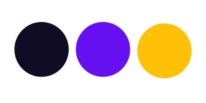

# MS2 Project for Code Institute 2020

## Overview

### [Live Demo](https://gisellenessi.github.io/Memory-Game/)

A retro-style game app build using JavaScript, HTML and CSS

The game app features two games. The first is a simple memory card game where the user must find matching pairs by turning over two cards at a time, and to win they must find all the matches. The second game is the classic memory skill game Simon. The game board has instructions on how to play, which requires the user to repeat sound and colour sequences which are dictated by the board.

The idea of this project is to provide a simple game application for both kids and adults to enjoy a break and exercise the brain by playing memory games. This application has the potential to expand and include several more games to create a library of retro-style memory games for users.

### Target audience

The target audience for this game app is game lovers, kids and adults alike, who are interested in playing a quick and fun game while enjoying a break or leisure time. The app is accessible to most people as it comes with a simple set of rules about how to play the games and it doesn’t require any previous experience. A user looking to boost their memory can play this game on a regular basis.

## UX

This project recreates the classic games of memory card and Simon in a retro-style single page application.

In order to make the user experience as seamless as possible as well as being fun, I decided on a simple single-page application that includes a header introduction, a navigation menu, a refresh button to start a new game and a footer with contact information. All of this is easy and accessible for the user to interact with within the app.

### User stories

- “As a user, I would like to_____”

- Take regular breaks from my work and play a fun game to improve my memory

- Have a simple and straightforward app with instructions about how to play retro games

- Be able to track my score in the game while playing

- Have the option to easily refresh the game to start over again

- Be able to get in touch with the owner of the app with feedback

- Be able to play the game with sound, to make the game accessible for those with poor sight or vision disability

## Design

Design and layout are mainly focused on fun and simplicity. 

### Framework

Bootstrap was used as my framework of choice due to its flexibility in responsiveness and its modern look and feel.

### Colour palette

The colour palette was chosen to create a fun and nostalgic atmosphere. For this I used bright, neon colours and a dark mode visual application to simulate real arcade environments full of colours and bright lights.

### Fonts

The game app uses two font-families from Google fonts. The first font-family is ‘Press Start 2P'’, a pixel-like font in keeping with the theme of the application, which is used for all titles. The second font-family is 'Roboto Mono', used for the rest of text and paragraphs. This font was chosen as it is easier to read, making it suitable for more text-heavy instructions throughout the application.

### Responsitivity

This website is fully responsive to all screen sizes and devices, making the app easy to navigate. It was a challenge to make both of the games responsive enough for mobile-view. While I applied some media queries to make the games as legible as possible, I recommend that users use the app on bigger-sized screens for now.

### Wireframes

- [Games](images/wireframes/games.JPG)
- [Mobile](images/wireframes/mobile.JPG)
- [Desktop](images/wireframes/Desktop.JPG)

## Features
### Features in use 

- All content is displayed on one single page application.
- Navbar: Contains logo link, contact buttons to navigate to a contact form and social icons, and a “refresh game” button to start the games again. Navigation is intuitive and clear.
- Refresh game button - Located on the navbar, this will reset the page and re-start the games.
- Interactivity: The game app will give clear feedback about the game being played and how to interact with it, including rules, current score, notification of right or wrong action and of when the game has been won.
- Audio: The Simon game has sound implemented when the user is playing, to indicate game sequence, success or failure.
- Contact form: email delivery is working and utilises a pop-up alert to let users know of success or error when sending.
- Back to top button: in the footer, back to top button for an easy navigation back to the header.

### To be implemented

- Add different levels to increase the difficulty
- Add the option to have a second player
- Add more retro games to build an arcade of games
- Add a login feature for users to save the history of their scores

## Technologies used

For the development of this project I built the two games using slightly different approaches towards the code, to have two different learning outcomes.

- **1st Game** - Memory Card Game: Built with plain Javascript syntax and data-types to insert and manipulate elements in the page. Using my knowledge of Javascript syntax and data-types. Putting ES6 and some basic DOM concepts into practice.

- **2nd Game** - Simon: Built using Javascripts and jQuery. For this game I decided to use the jQuery library to simplify some tasks in the code. I also used DOM manipulation as this game is a bit more complex than the previous one and requires different sequences of flashing colours.

- **Other learnings include branching in Github**: From the master branch I created a new branch by typing 'git checkout -b simon-game-feature master' on my terminal. I then worked on that new branch to create the Simon game feature, once finished I successfully merged to master branch typing 'git merge master' on my terminal.

This languages, frameworks, libraries and other tools utilised for building this retro gaming app are:

- **HTML5** - The gaming app uses HTML5 as the fundamental basis for building the app
- **CSS3** - The game app uses CSS3 for the styling of all elements within the website. It is linked from the page to the style.css file and is used for all content, including colour pallets, navbar, background, images, title, fonts, etc.
- **Bootstrap 4.1.3** - The Bootstrap framework has been used to implement the layout of the game app and also used to ensure responsiveness and mobile-first design.
- **JavaScript** - The game app uses Javascript to provide dynamic interactivity for users
- **jQuery** - The game app uses jQuery to simplify some tasks, such as DOM manipulation
- **Email.js** - To send emails through the contact form
- **Fontawesome** - The game uses fontawesome for all icons
- **VScode** - Visual Studio Code was my IDE of choice for this project
- **Github** - Has been used for version control of the code using Git functions and remote storage of the project
- **Google fonts** - The game app uses Google fonts for all project fonts

## Testing
### Validators

- [W3C HTML Validator](https://validator.w3.org/)
  - No error, warnings reported not affecting the code.

- [W3C CSS Validator](https://jigsaw.w3.org/css-validator/)
  - No error, some warnings reported about the use of name of some colours instead of hex. This is not affecting the code.

- [JSHint](https://jshint.com/)
  - No errors found. Warnings about using ES6 version of Javascript.

### Manual test 

Several manual tests, using various methods of testing, were performed to ensure the best possible user experience. 
The aim is to check the functionality of the code on different devices (mobile, tablet, desktop) and to give an overall perspective of responsiveness and mobile-first design. The site has been viewed and tested in Firefox, Safari, Chrome and Explorer. The devices used to test the site are iPhone 5/SE, Samsung Galaxy, iPad, iPhone X, iPhone 6/7/8 and Macbook Pro laptop.

## Issue List

 | Issue  |                 Description                     |       Solution                      |  
  | ------ |:-----------------------------------------------:|:-----------------------------------:|
  |   1    |Although both games work on mobile, the user experience is optimised for use on desktop |The game is intended for use on bigger screens, alert the user of this|
  |   2    |Navigation works as expected but scrolling was too aggressive |Applied scroll-behavior: smooth; on css and fixed the issue|
  |   3    |Issue when flipping cards on the memory card game - showing only half the image|Attempted to fix with transform option in CSS but issue comes back|
  |   4    |”Refresh game” button working with a visual glitch issue |Decided to ignore as this is not affecting the functionality of the games |
  |   5   |HTML Validation warning "Section lacks heading" | This warning can be ignored as does not affect code |
  |   6   |Is HTML self explanatory  | Added further comments to index.html file |
  |   7   |Is app.js self explanatory  | Added detail comments |

## Deployment
### Local Development

This project can be run locally by going to this [Repository link](https://github.com/GiselleNessi/Memory-Game) and clicking on the Clone or Download button and copying the link provided.

In your IDE of choice, open a Terminal window and change to the directory where you want to clone this project and type `Git clone "your copied link"`.

After pressing Enter the project will be created and cloned locally.

### Live Version
The live version of this website is hosted on [GitHub Pages](https://gisellenessi.github.io/Memory-Game/).

The method used to deploy this website was as follows:

1. In **GitHub**, navigated to my repository.
2. Under my repository, clicked **"Settings"**.
3. Under the **"GitHub Pages"** section, used the Source drop-down menu and selected a publishing source, in this case the Master Branch .
4. The website was immediately published and a green tab appeared with a link to the **live website**.
5. The link obtained is the one displaying at the top of this document.

## Credits
### Content

- [Play retro games](https://www.playretrogames.com/) served as trigger and inspiration. 

### Media

- All the images for this app were taken from (https://www.freepik.com/) 
- All the sound for this app were taken from (https://freesound.org/) 

### Code

This app was a good challenge and I want to give credit to the following:

- [Stack Overflow](https://stackoverflow.com/) The place to find answers of all kinds.
- [W3Schools](https://www.w3schools.com/) Another really good and complete source of information.

### Acknowledgements

- Rohit for his patient mentorship

